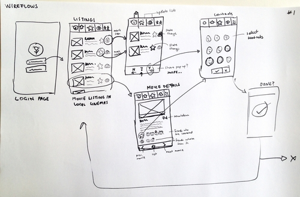

Time to take the abstract to concrete. Sketch rough layouts of screens focused on **features** and **flow**.

It’s best to do this part in a group. Get together and review the personas, journeys, and flows, and answer any pressing questions together. Determine which flows you will sketch. Then, get thick markers, printer paper, and designate a timekeeper. Allow for 5 minutes of individual sketching time per flow, working on as many unfiltered iterations as possible in that time limit. Treat this much like improv - try not to self-edit or rule out anything just yet. Once you’re done, compare sketches as a group and work towards creating a clean version that incorporates the best of all the ideas.

Guidelines:
* Fidelity is at its lowest. Use the “thick marker rule” - the thicker the marker, the more you force yourself to keep the designs to a conceptual level, as it’s difficult to add in details when the marker tip is so large. Whiteboard markers are great here too, just take photos!
* Little or no specific content
* No sense of scale or grid
* Think in flows whenever possible (what pages comes after?)
* Recheck with your flow diagram - what part of the flow is not yet in the sketch?
* Never settle for your first idea

Clean up and consolidate your ideas on device paper. Note: keeping your sketches on device paper at this stage (in lieu of a digital program) saves time, and also helps the partner feel more invited to provide feedback.

**Present 2-3 clean versions on device paper to the partner for feedback. Each version should be different enough discuss direction and determine a plan to move forward.**

Example Device Paper:
Feel free to use this or make your own, appropriate for the device you are developing for.

