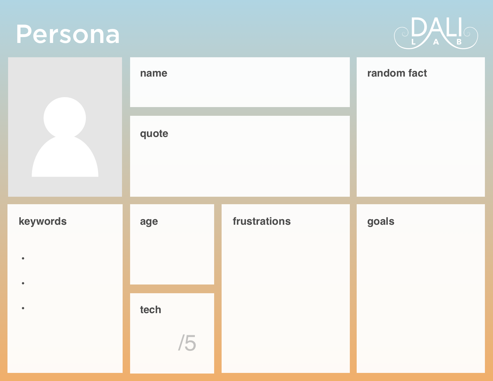

Personas are hypotheses informed by our research. They capture basic demographics, motivations, and frustrations.

Benefits:
  * defines the user type(s)
  * inspires empathy for the user(s)
  * serves as the basis of user-oriented design decisions

## Tasks:
    * Synthesize your User Research notes
    * Create 2-4 Personas that accurately describe the variety of users - aim to create these together in your team meeting
    * Consult this template to fill in details about your users. (Feel free to include any additional details that help you think about and understand your user in relation to your project e.g., knowledge, skills, interest, technique, languages, platform, etc.)

* Quote: pick a key moment to describe their character, their emotions, or their experiences
* Random Fact: add something real, humanizing, and quirky
* Keywords: a quick summary of standout personality traits, especially tags that might heavily affect design decisions
* Age: hints at a mindset based on current life phase, generation, and their cultural and economic experiences
* Tech-savviness: the lower the number, the more critical it is to make the design intuitive
* Frustrations: what must be fixed to improve the user experience
* Goals: what the users want to achieve in life – what motivates them
