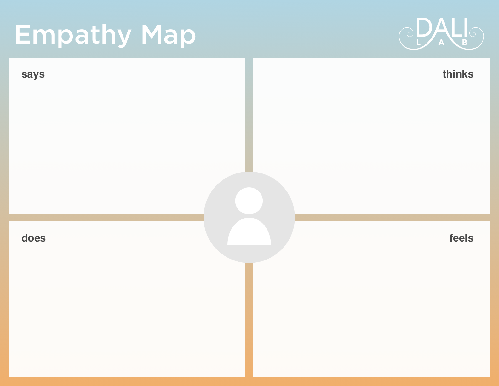

Determine your users (your partner might have provided a few types in the Kickoff Meeting). Uncover the user needs and pain points, ultimately helping you design for the user.

It’s not always easy to find users, let alone interview them. But the more end users you talk to, the more likely you are to have a successful project. Determine who you will get answers from, and how you will go about it.

* Interview: This can be 1 on 1 or a small group of users. The smaller the environment, the more likely they are to share antidotes.
* Survey: For a larger sample, and anonymous responses.
* Ask the partner: They know their target user, but be careful not to rely on this since they might be biased or have made assumptions to confirm their hypothesis.
* Workshop: For an extra challenge (and a fun time!), consider conducting a “Co-Creation” Workshop and invite the users to discuss and solve their own problems.

Research questions to keep in mind:
* what are the users trying to do?
* how are they currently doing it?
* what the problems or frustrations do they experience?
  * be sure to probe to get to the WHY
* what do users need to achieve their goal?

Make one Empathy Map per user interviewed to articulate what you learned, and help team members understand the user’s mindset.


