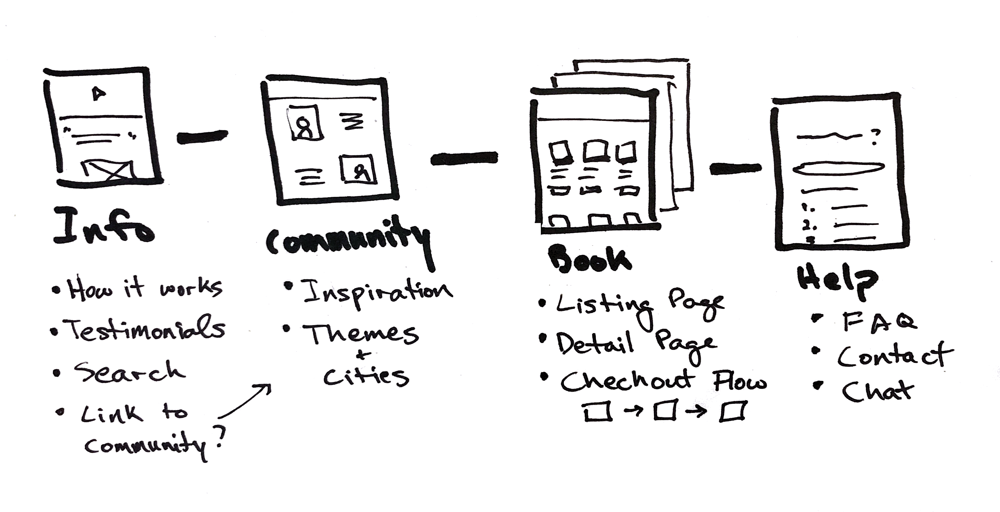

In tandem with the Feature Spec, develop a high level understanding of how these features relate.

Benefits:
  * determine which features to focus on and how they come together
  * prioritizes features for build

Here are some options:

### Write a Story:
Lace together all the features from your feature list into a cohesive script.
  * Solidify the concept, the user, and the setting.
  * Add detail to rely on later in the design phase (i.e. scenario-based user testing and narration for the demo video).

 

### Create a Flow Diagram:
A flow diagram documents the tasks the user will perform, in relation to each other and over time. Create flows for the primary tasks, but keep this in sketch or text form (best to not dwell on how it looks at this stage but rather how these elements connect to each other).

 
### Sketch the Site Architecture:
Another method to determining this network would be to quickly jot down the architecture of the project. Marking pages or features horizontally shows relative breadth, while nesting pages or features below those pages shows depth. This helps describe how “flat” or “deep” an experience would be. While you should keep these sketches loose and freehand, checkout what a [polished version](https://speckyboy.com/collection-inspiring-sitemaps-user-flow-maps/) looks like for some inspiration.

 

### Additional guidance  

##### Managing differing opinions:
* User A says they love hitting the snooze button, but User B says they prefer to just jump out of bed and get going. If you were trying to design a better wake up experience, what would you do?
The key is realizing that one size (or app) doesn't fit all. Users A and B both offer super valuable insights, which will allow you to design states for both Persona types (users who use snooze, and users who do not - for example).

##### Specifying your users:
* You may determine with your partner that the product you are designing is specifically for those who have *difficulty* waking up. In which case, you operate on the basis that you are designing for User A, not as much for User B. If User B was it's own Persona that doesn't have difficulty waking up, you can set it aside.
